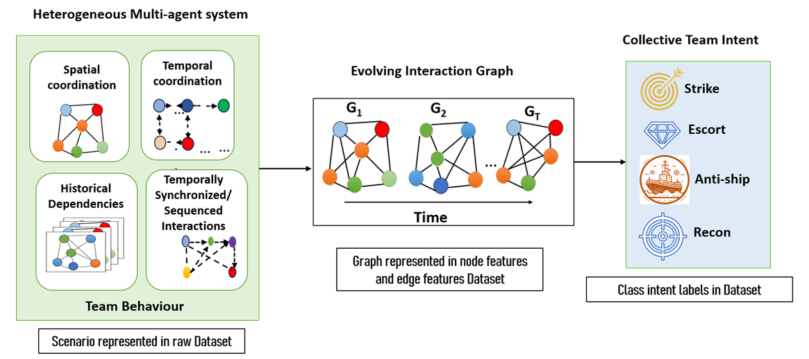

# Heterogeneous-Team-Intent-Dataset

Heterogeneous-Team-Intent-Dataset is a benchmark dataset designed for research on team-level intent prediction and opponent modelling in heterogeneous multi-agent environments. The dataset contains multiple air combat mission scenarios in which autonomous agents exhibit coordinated spatial and temporal behaviours while executing complex tactical manoeuvres through synchronized and sequential interactions.

Unlike conventional trajectory datasets that focus primarily on individual agent motion, this dataset captures the collective dynamics underlying coordinated team behaviour. The latent mission intent is not explicitly observable but is implicitly encoded in the evolving interactions among team members. Consequently, the dataset provides a challenging benchmark for developing AI models capable of inferring hidden collective intent from temporal multi-agent interactions, enabling proactive decision-making in adversarial environments.

Air combat is used as the case study due to its highly dynamic and coordination-intensive nature; however, the dataset is intended to support broader research in heterogeneous multi-agent systems, temporal graph learning, collective behaviour modelling, team reasoning, and autonomous decision support.

The complete dataset contains 74 heterogeneous air combat scenarios consisting of raw trajectories, node features and edge features. To keep the GitHub repository lightweight, representative sample scenarios are included. The complete dataset will be made publicly available upon reasonable request.
## Dataset Overview

